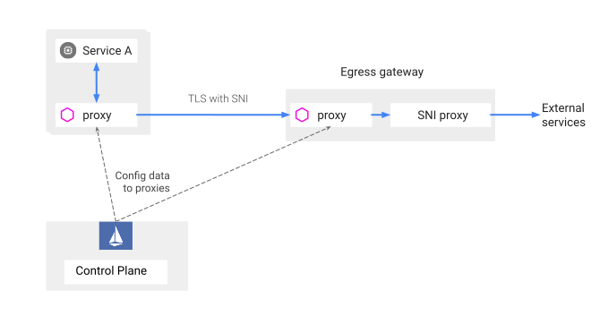

# ISTIO mTLS Egress

## egress-mtls.yaml
**NOTE:** Example to enforce mTLS between sidecar and egress gateway. This is a basic setup that does have wildcard domain, that routes through egress gateway


## wildcard-egress-mtls.yaml
**NOTE:** The configuration for accessing a wildcard host via an egress gateway depends on whether or not the set of wildcard domains are served by a single common host. This is the case for `*.wikipedia.org`. All of the language-specific sites are served by every one of the wikipedia.org servers. You can route the traffic to an IP of any *.wikipedia.org site, including www.wikipedia.org*, and it will manage to serve any specific site.

```bash
 kubectl exec $(kubectl get pod -l istio=egressgateway -n istio-egress -o jsonpath='{.items[0].metadata.name}') -c istio-proxy -n istio-egress -- pilot-agent request GET clusters | grep '^outbound|443||www.wikipedia.org.*cx_total:'
outbound|443||www.wikipedia.org::185.15.59.224:443::cx_total::5
```

```bash
istioctl proxy-config listeners ubuntu-tls-test-bfccb8899-clvt2 | grep wiki
0.0.0.0         443   SNI: *.wikipedia.org                                                     Cluster: outbound|443|wildcard|istio-egressgateway.istio-egress.svc.cluster.local
```


```bash
curl -s https://de.wikipedia.org/wiki/Wikipedia:Hauptseite | grep -o "<title>.*</title>"
<title>Wikipedia – Die freie Enzyklopädie</title>

root@ubuntu-tls-test-bfccb8899-clvt2:/# curl -s https://en.wikipedia.org/wiki/Wikipedia:Hauptseite | grep -o "<title>.*</title>"
<title>Wikipedia:Hauptseite - Wikipedia</title>
```

## wildcard-egress-sni-proxy.yaml

### Architecture
<p align="center">

</p>

**NOTE: Wildcard configuration for arbitrary domains**

The configuration in the previous section worked because all the *.wikipedia.org sites can be served by any one of the wikipedia.org servers. However, this is not always the case. For example, you may want to configure egress control for access to more general wildcard domains like `*.com or *.org`.

```bash
# curl requests from ubuntu client machine
curl -s https://de.wikipedia.org/wiki/Wikipedia:Hauptseite | grep -o "<title>.*</title>"
<title>Wikipedia – Die freie Enzyklopädie</title>

root@ubuntu-tls-test-bfccb8899-d8mhh:/# curl -s https://en.wikipedia.org/wiki/Main_Page | grep -o "<title>.*</title>"
<title>Wikipedia, the free encyclopedia</title>
```

### check the logs of Ubuntu client machine
As you can see, Wikipedia requests were sent through the gateway
```bash
$ kubectl logs ubuntu -c istio-proxy -n default
[2024-05-07T13:21:52.793Z] "- - -" 0 - - - "-" 813 111152 61 - "-" "-" "-" "-" "172.17.5.170:8443" outbound|443|wildcard|egressgateway.istio-egress.svc.cluster.local 172.17.34.35:55102 208.80.153.224:443 172.17.34.35:37020 en.wikipedia.org -
[2024-05-07T13:21:52.994Z] "- - -" 0 - - - "-" 821 92848 55 - "-" "-" "-" "-" "172.17.5.170:8443" outbound|443|wildcard|egressgateway.istio-egress.svc.cluster.local 172.17.34.35:55108 208.80.153.224:443 172.17.34.35:37030 de.wikipedia.org -
```

### Check the logs of egress-gateway
```bash
export GATEWAY_POD=$(kubectl get pod -n istio-egress -l istio=egressgateway -o jsonpath={.items..metadata.name})
```

```bash
$ kubectl logs $GATEWAY_POD -c istio-proxy -n istio-egress
[2024-04-30T16:19:15.866Z] "- - -" 0 - - - "-" 806 5378 82 - "-" "-" "-" "-" "185.15.59.224:443" dynamic_forward_proxy_cluster 10.1.1.172:58604 envoy://sni_listener/ envoy://internal_client_address/ de.wikipedia.org -

[2024-04-30T16:17:57.241Z] "- - -" 0 - - - "-" 806 5367 58 - "-" "-" "-" "-" "185.15.59.224:443" dynamic_forward_proxy_cluster 10.1.1.172:58156 envoy://sni_listener/ envoy://internal_client_address/ en.wikipedia.org -
```
